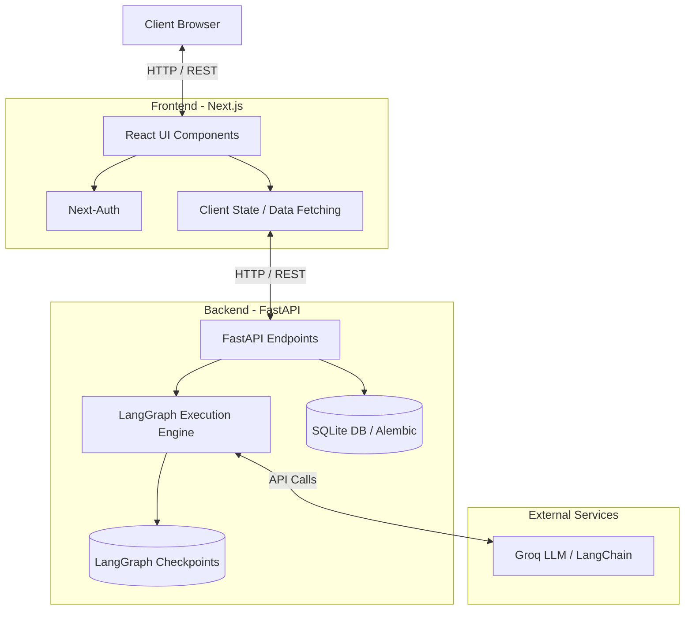

# Scaffold AI

Scaffold AI is an advanced, AI-driven project scaffolding platform designed to accelerate development workflows. By leveraging state-of-the-art language models and graph-based execution pipelines, it enables automated generation, structuring, and management of complex software projects.

## Architecture Overview

The system is built on a modern, decoupled architecture, utilizing a robust frontend for user interactions and a highly concurrent backend for executing AI workloads and managing state.



## Technology Stack

### Frontend
- **Framework:** Next.js
- **Styling:** Tailwind CSS, Radix UI Primitives, Framer Motion
- **Authentication:** Next-Auth
- **Data Visualization:** Recharts
- **Icons:** Lucide React
- **Language:** TypeScript

### Backend
- **Framework:** FastAPI
- **AI / LLM:** LangGraph, LangChain, Groq
- **Database:** SQLite (with AsyncIO support via aiosqlite)
- **ORM & Migrations:** SQLAlchemy, Alembic
- **State Management:** LangGraph Checkpoints
- **Language:** Python

## Getting Started

### Prerequisites
- Node.js (v18 or higher recommended)
- Python (3.10 or higher recommended)

### Backend Setup

1. Navigate to the backend directory:
   ```bash
   cd backend
   ```
2. Create and activate a virtual environment:
   ```bash
   python -m venv venv
   # On macOS/Linux:
   source venv/bin/activate
   # On Windows:
   venv\Scripts\activate
   ```
3. Install dependencies:
   ```bash
   pip install -r requirements.txt
   ```
4. Configure environment variables. Create a `.env` file in the `backend` directory based on the project requirements (e.g., setting Groq API keys, database URLs).
5. Run database migrations:
   ```bash
   alembic upgrade head
   ```
6. Start the FastAPI development server:
   ```bash
   uvicorn app.main:app --reload
   ```

### Frontend Setup

1. Navigate to the frontend directory:
   ```bash
   cd frontend
   ```
2. Install dependencies:
   ```bash
   npm install
   ```
3. Configure environment variables. Create a `.env.local` file in the `frontend` directory.
4. Start the Next.js development server:
   ```bash
   npm run dev
   ```

## Development

The repository is structured to enforce clear separation of concerns:
- **`backend/app/`**: Contains the FastAPI application, database models, LangGraph nodes, and core business logic.
- **`backend/alembic/`**: Houses database migration scripts.
- **`frontend/src/`**: Contains React components, Next.js routing configurations, and application assets.

## License

See the [LICENSE](LICENSE) file for more information.
